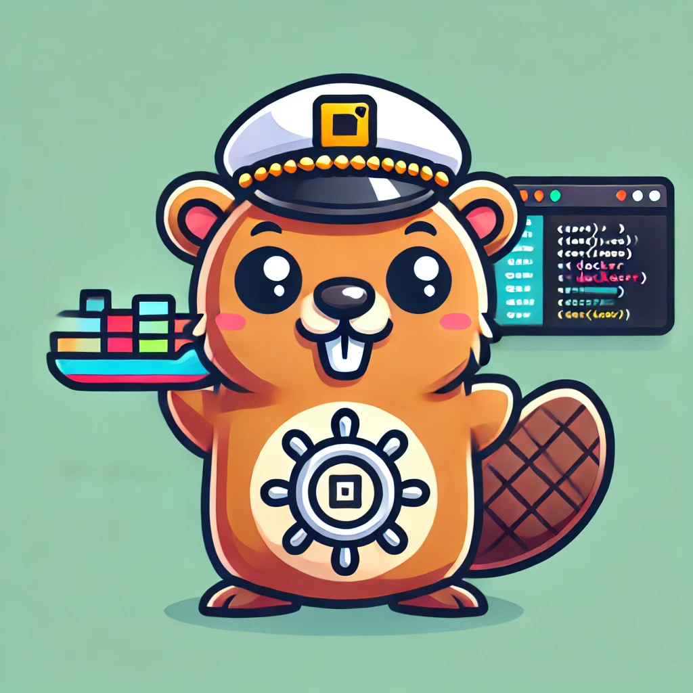

# DockerNav - A Terminal UI for Docker Management

<p align="center">

</p>

<p align="center">
  
  
  
</p>

**DockerNav** is a terminal-based user interface for managing Docker resources. Built with Go and the Charm libraries (Bubbletea, Bubbles, Lipgloss), it provides an intuitive TUI to manage containers, images, networks, volumes, and system information without leaving your terminal.

## Table of Contents

- [Features](#features)
- [Installation](#installation)
- [Usage](#usage)
- [Architecture](#architecture)
- [Development](#development)
- [Contributing](#contributing)
- [License](#license)

## Features

- **Container Management**: Create, start, stop, restart, remove, and view logs of containers
- **Image Management**: Pull, list, and remove Docker images
- **Network Management**: Create, list, inspect, and remove Docker networks
- **Volume Management**: Create, list, inspect, and remove Docker volumes
- **System Information**: View Docker system information, version, and disk usage

<details>
<summary>Feature Screenshots (click to expand)</summary>

**Main Menu**


**Container Management**


**Image Management**


**Logs of Container**


</details>

## Installation

### Prerequisites

- Go 1.23 or higher
- Docker Engine running on your system

### From Source

```bash
# Clone the repository
git clone https://github.com/Gostatsog/dockerNav.git
cd dockerNav

# Build the application
make build-mac    # For macOS
make build-linux  # For Linux

# Alternatively, you can install directly
make install
```

### Binary Releases

You can download pre-built binaries from the [releases page](https://github.com/Gostatsog/dockerNav/releases).

## Usage

Start DockerNav by running:

```bash
dockerNav
```

### Navigation

- Use numbers `1-5` to navigate between different views
- Press `m` to return to the main menu from any view
- Press `q` or `Ctrl+C` to quit the application

### Keyboard Shortcuts

| Key | Action |
|-----|--------|
| `r` | Refresh current view |
| `esc` | Go back / Cancel action |
| `m` | Return to main menu |
| `q` | Quit application |

<details>
<summary>Container Management Shortcuts</summary>

| Key | Action |
|-----|--------|
| `a` | Start container |
| `s` | Stop container |
| `t` | Restart container |
| `l` | View container logs |
| `c` | Create new container |
| `x` | Remove container |

</details>

<details>
<summary>Image Management Shortcuts</summary>

| Key | Action |
|-----|--------|
| `p` | Pull new image |
| `x` | Remove image |

</details>

<details>
<summary>Network Management Shortcuts</summary>

| Key | Action |
|-----|--------|
| `i` | Inspect network |
| `c` | Create new network |
| `x` | Remove network |

</details>

<details>
<summary>Volume Management Shortcuts</summary>

| Key | Action |
|-----|--------|
| `i` | Inspect volume |
| `c` | Create new volume |
| `x` | Remove volume |

</details>

<details>
<summary>System Management Shortcuts</summary>

| Key | Action |
|-----|--------|
| `1-4` | Switch between system views |
| `p` | Prune system |

</details>

## Architecture

DockerNav follows a clean architecture with separation of concerns. Here's an overview of the project structure:

```
dockerNav/
├── cmd/
│   └── dockerNav/         # Application entry point
├── internal/
│   ├── client/            # Docker client wrapper
│   └── ui/                # Terminal UI components
├── pkg/
│   └── formatter/         # Utility functions for formatting
└── Makefile               # Build automation
```

### Component Diagram


### UI State Flow


## Development

### Building from Source

```bash
# Clone the repository
git clone https://github.com/Gostatsog/dockerNav.git
cd dockerNav

# Build the application
make
```

### Available Make Commands

- `make`: Build binaries for both macOS and Linux
- `make build-mac`: Build only for macOS
- `make build-linux`: Build only for Linux
- `make clean`: Remove build artifacts
- `make test`: Run tests
- `make lint`: Run linter
- `make run`: Build and run the application
- `make install`: Install to GOPATH/bin

### Project Structure

<details>
<summary>Detailed Project Structure</summary>

```
dockerNav/
├── cmd/
│   └── dockerNav/
│       └── main.go            # Application entry point
├── go.mod                     # Go module definition
├── go.sum                     # Go module checksum
├── internal/
│   ├── client/
│   │   └── docker.go          # Docker client wrapper
│   └── ui/
│       ├── containers.go      # Container UI model
│       ├── container_create.go # Container creation form
│       ├── image_model.go     # Image UI model
│       ├── main.go            # Main UI model
│       ├── network_model.go   # Network UI model
│       ├── styles.go          # UI styling definitions
│       ├── system_model.go    # System UI model
│       └── volume_modal.go    # Volume UI model
├── Makefile                   # Build automation
└── pkg/
    └── formatter/
        ├── formatters.go      # Utility formatting functions
```

</details>

### Key Components

#### Docker Client

The `internal/client/docker.go` file wraps the Docker SDK to provide a simplified interface for interacting with the Docker Engine:

```go
// DockerClient wraps the Docker client SDK
type DockerClient struct {
    Client *client.Client
    Ctx    context.Context
}
```

#### UI Models

Each section of the application is managed by a dedicated model implementing the Bubble Tea model interface:

```go
type Model interface {
    Init() tea.Cmd
    Update(msg tea.Msg) (Model, tea.Cmd)
    View() string
}
```

#### Main Model

The main model coordinates between different views and manages the overall application state:

```go
type MainModel struct {
    dockerClient   *client.DockerClient
    currentView    View
    containers     *ContainerModel
    images         *ImageModel
    networks       *NetworkModel
    volumes        *VolumeModel
    system         *SystemModel
    // ... other fields
}
```

## Dependencies

DockerNav relies on several libraries:

- [Bubble Tea](https://github.com/charmbracelet/bubbletea) - TUI framework
- [Bubbles](https://github.com/charmbracelet/bubbles) - UI components for Bubble Tea
- [Lipgloss](https://github.com/charmbracelet/lipgloss) - Styling for terminal applications
- [Huh](https://github.com/charmbracelet/huh) - Form component library
- [Docker SDK](https://github.com/docker/docker) - Docker Engine API client

## Contributing

Contributions are welcome! Please feel free to submit a Pull Request.

1. Fork the repository
2. Create your feature branch (`git checkout -b feature/amazing-feature`)
3. Commit your changes (`git commit -m 'Add some amazing feature'`)
4. Push to the branch (`git push origin feature/amazing-feature`)
5. Open a Pull Request

## License

This project is licensed under the MIT License - see the LICENSE file for details.

---

## Acknowledgments

- [Charm](https://charm.sh) for their amazing terminal UI libraries
- [Docker](https://www.docker.com) for their comprehensive API

---

> **Note**: This project is currently in alpha stage. Some features might not work as expected.

For support, please [open an issue](https://github.com/yourusername/dockerNav/issues) on GitHub.

[^1]: DockerNav is not affiliated with Docker, Inc.